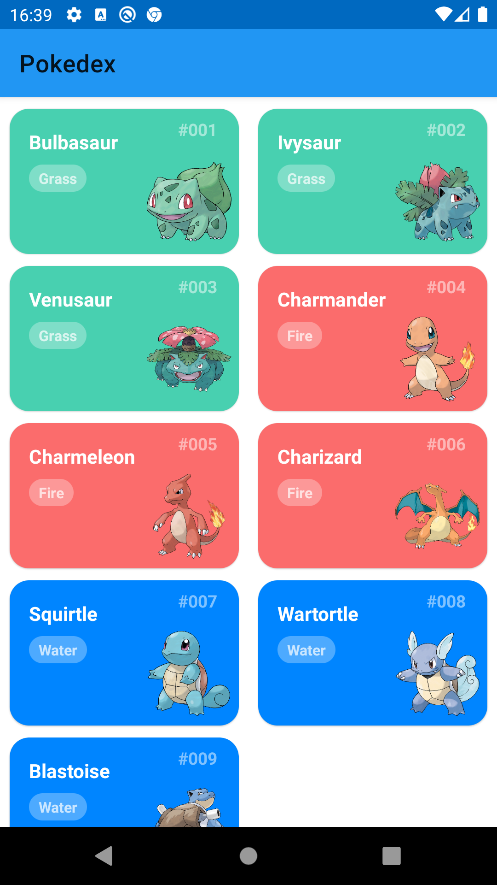

# Technical assessment

This small set of exercises is intended to test some basic abilities as a software developer.

## Exercise 1

Clone this repository in your development machine. You should answer the questions below directly in this text file and commit the answers to your local copy of the repository.

## Exercise 2

Given the following piece of code, written in Java:

```java
public class SomethingIsWrong {
    public static void main(String[] args) {
        Rectangle myRect;
        myRect.width = 40;
        myRect.height = 50;
        System.out.println("myRect's area is " + myRect.area());
    }
}
```

a. What is wrong with the code?
b. How can we fix it?

## Exercise 3

Consider the following two classes:

```java
public class ClassA {
    public void methodOne(int i) {
    }
    public void methodTwo(int i) {
    }
    public static void methodThree(int i) {
    }
    public static void methodFour(int i) {
    }
}

public class ClassB extends ClassA {
    public static void methodOne(int i) {
    }
    public void methodTwo(int i) {
    }
    public void methodThree(int i) {
    }
    public static void methodFour(int i) {
    }
}
```

a. Which method overrides a method in the superclass?  
b. Which method hides a method in the superclass?  
c. What do the other methods do?

## Exercise 4

a. What is the difference between Dependency Inversion and Dependency Injection?

b. Why should we use each one?

## Exercise 5

Open the [Pokedex](./Pokedex) project on [Android Studio](https://developer.android.com/studio). When you execute it you will see this screen:

<div align="center">
    
</div>

<br/>
<br/>

You need to make the necessary changes for it look like this:

<div align="center">
    
</div>

## Exercise 6

Create a private repository and push these exercises to it. Tip: add a new remote repository to your local git copy. Keep the repository private and grant access only to codehashi@codehashi.com.
